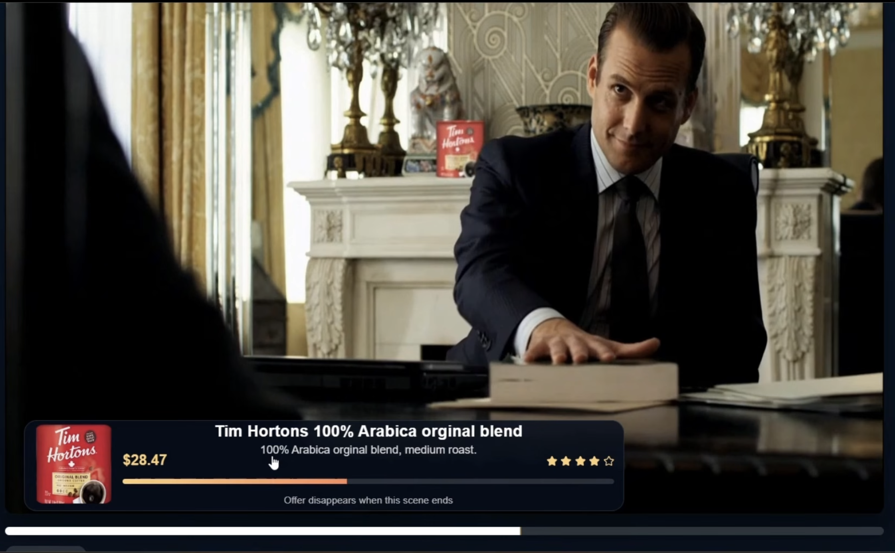

## Inspiration
Advertising has always been a **point of tension between streaming platforms and their users**. Show too many ads, and **viewers become frustrated**; show too few, and **platforms lose revenue**. Mid-show ads are especially disruptive because they **break immersion**, interrupt dramatic moments, and often feel abrupt. On the other hand, ads at the beginning often receive less user attention. This behaviour is similar to movie theatres, where many people intentionally arrive 15–20 minutes after the scheduled start time to avoid pre-show ads. 

This led us to ask:
- What if ads did not appear abruptly, but instead blended naturally into the viewing experience?
- What if they were personalized to each user, visible without demanding full attention, and seamlessly integrated in a way that does not interfere with actors or storytelling?
- And what if the native objects and decorations in a movie or show could be transformed into ads?

## What it does
**BackstageCommercials** is a framework for embedding personalized ads directly into the background of movies and TV shows. Instead of interrupting viewers with traditional ad breaks, it integrates Amazon-recommended products naturally into the scene itself. The framework can insert an AI-generated product into the background or replace an unused background object with a product-matched alternative.

Each inserted product is paired with a subtle on-screen pop-up that appears for the duration of the scene, giving the viewer direct access to the Amazon product page. With one click, or a voice command, a NovaAct agent can automatically add the product to the user’s Amazon cart. This creates a seamless shopping experience without disrupting immersion.

The framework also makes it easier for users to discover decor and products they notice while watching. Rather than taking screenshots, searching with Google Lens, and manually browsing results, the viewer can simply ask Nova, _“Find this tablecloth on Amazon.”_ Nova then finds a visually similar product and automatically adds it to the user’s wishlist.

## Screenshots



## How we built it
Our pipeline is: select a scene -> identify a horizontal/flat surface on the frame -> place a reference product into the frame -> use Nova agents to enable shopping.

**Starting frame selection:**
We first identify scene cuts and choose strong candidate frames for product insertion.
Using OpenCV, we compare neighboring frames and rank candidates based on minimal background motion, which makes placement more stable across the clip. From these candidates, an Amazon Nova model selects the best starting frame.

**Product placement:**
Next, an adjuster Amazon Nova model predicts the product placement on the first frame of the cut. It returns: the XY corner coordinates of the bounding box,  the reference width and height of the product.

A second critic Nova model then evaluates whether the placement is physically plausible. If the object appears to float, collide unnaturally, or sit in an impossible position, the critic asks the adjuster to generate a new placement.

Once a valid bounding box is selected, we send the frame, bounding box, and reference product image to the FLUX Kontext model with the Finegrain product-placement LoRA adapter, which blends the product into the scene so it appears naturally embedded.

The selected bounding box is then propagated to subsequent frames. This is why a static or near-static background is important. To preserve realism, we use YOLOv8 segmentation to mask moving foreground objects, such as actors, and composite them back over the inserted product. This creates the effect that the product truly exists in the background of the original video.

**Shopping agents:**
Two Nova agents work together through Flask endpoints:
* **Amazon Nova 2 Lite** acts as the reasoning agent. It identifies objects in the frame, extracts a description of the requested item, and searches the web for the most similar products.
* **NovaAct** is the UI agent. It opens the browser and adds the selected item to the user’s Amazon cart or wishlist.
* When requested, the agent can also find **multiple similar products** and add them all to the wishlist, so the user can compare options later.

**References:**

[Build with Nova](https://nova.amazon.com/dev) - agents, browser search.

[Frontend design inspiration](https://dribbble.com/shots/22647225-Prime-video-animated-screen) - concept for possible Prime-style integration.

[Flux 1 Kontext model](https://huggingface.co/black-forest-labs/FLUX.1-Kontext-dev) - core image generation model.

[Finegrain Product Placement model (LoRA)](https://huggingface.co/finegrain/finegrain-product-placement-lora) - adapts the reference product to the placement area.

[YOLO8-Seg(Ultralytics)](https://docs.ultralytics.com/tasks/segment/) - segments active foreground objects from the static background.

## Challenges we ran into
* **Compute limits:** Running FLUX at full precision required about **24 GB of VRAM**, which was too costly for our environment. We solved this by quantizing the model to **4-bit**, making inference practical on limited hardware.

* **Generation speed:** Product insertion on a single frame took **3 minutes**, so doing it across an entire cut (30-60FPS) was not realistic. Our workaround was to generate the product only on the **first frame of a scene**, then reuse that placement across the cut while using **YOLOv8 segmentation** to keep moving foreground objects in front.

* **Scene quality:** Product placement only works well when the scene has a stable background and a believable surface to place the object on. In many videos, fast motion, camera movement, or difficult angles made realistic insertion challenging.

## What's next for BackstageCommercials
* **2D to 3D:** upgrade our placement pipeline from flat-surface, mostly static scenes to 3D-aware product insertion. This would let us handle camera motion, perspective shifts, and more dynamic environments while keeping placements physically believable.

----
# How to run
#### Call Amazon Nova 2 Lite and NovaAct Agents:
```
python agent_api.py
```
Endpoints:
```
/find-it-on-amazon # Amazon Nova 2 Lite processes input frame and user request, returns Amazon link and item description.
/select-similar-from-amazon # NovaAct uses product description and find two (k=2 by default) best items that fit description well. Returns URL of the selected items.
/select-similar-from-amazon/add_to_list # Same as above but instead adds to the selected list on  Amazon.
/add-it-to-shopping-cart # NovaAct adds the product to the user's shopping cart.
/add-it-to-shopping-list # using product link adds it to the user's shopping cart.
```
#### Run Frontend App
```
cd frontend/prime-video-ui
npm install
npm install lucide-react
npm run dev
```
# backstage_commercials
